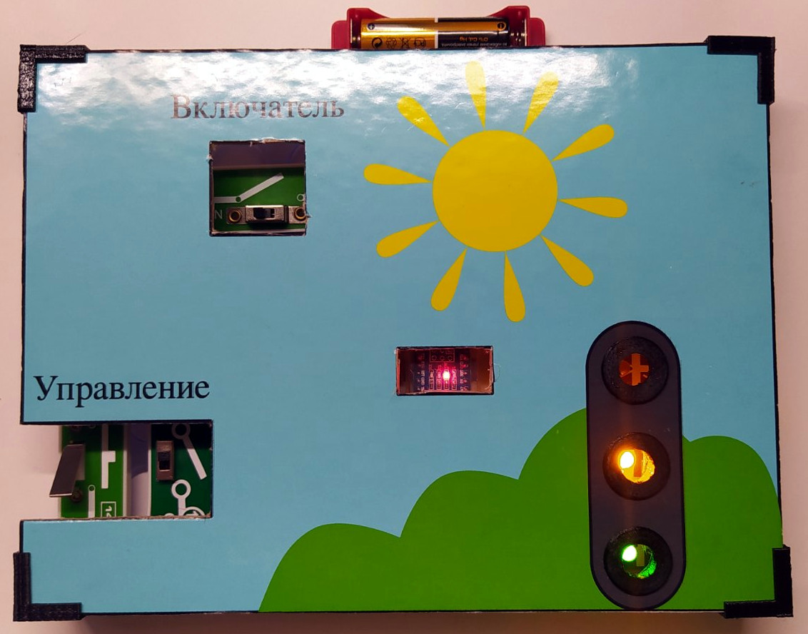
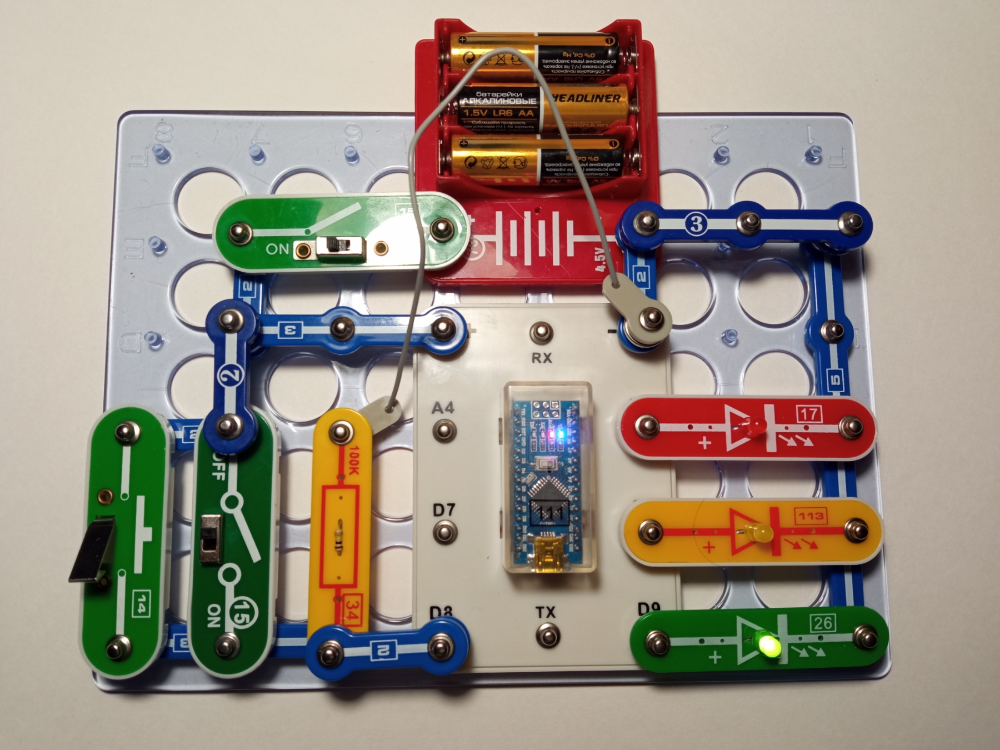
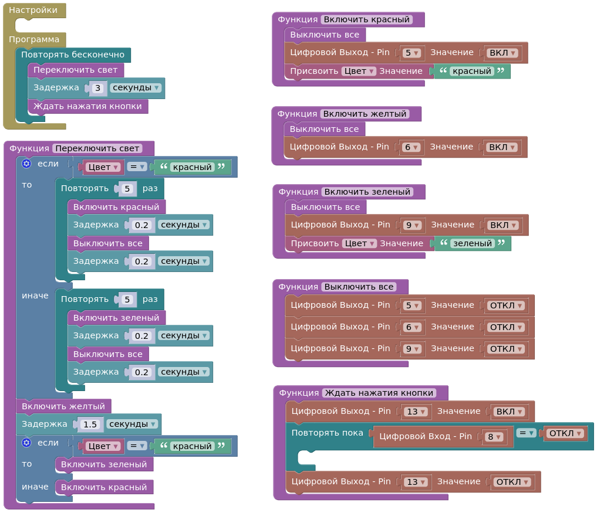

# Ardufor

Это учебный проект на тему «как устроен светофор» для детского сада на конкурс «Первые шаги в науку».

Проект представляет собой простой светофор, управляемый Arduino.
Основная цель проекта - Изучить как устроен и работает светофор, продемонстрировать, 
как можно использовать Arduino для управления дорожной сигнализацией, а также предоставить 
базовую модель, которую можно модифицировать и расширять для более сложных систем управления
дорожным движением.

Этот проект предназначен для начинающих в области Arduino и электроники.
Проект может быть использован в образовательных целях или для создания прототипов систем
управления дорожным движением в небольших масштабах.
Так как ребенку необходимо понимать, что и как работает, проект сделан на основе конструктора
«Знаток»: ярко, пайка не требуется, все наглядно.

## Управление

Светофор на плате запрограммирован так, что может работать в двух режимах: в автономном и
при физическом включении/выключении человеком.
Автономный вариант имитирует работу светофора с включением красного и зеленого сигнала
на 3 секунды, и желтого на полторы. По истечении времени у красного и зеленого сигналов
светодиоды мигают. Цикл повторяется автоматически.
Режим с человеческим участием выполняет две последовательности: красный-желтый-зеленый и
зеленый-желтый-красный. Между последовательностями светофор ожидает действия человека и
загорается индикатор, таким образом длительность одного из сигналов может быть произвольно увеличена.

## Схема

## Назначение контактов на плате
| Контакт | Тип               | Назначение        |
|---------|-------------------|-------------------|
| D5      | Дискретный выход  | Красный сигнал    |
| D6      | Дискретный выход  | Желтый сигнал     |
| D8      | Дискретный вход   | Кнопка управления |
| D9      | Дискретный выход  | Зеленый сигнал    |

## Программа

## Установка прогаммы и внесение изменений

Проект содержит [скетч Arduino](./src/svetofor/svetofor.ino) который может быть загружен в плату 
при помощи [Arduino IDE](https://arduino.ru/Arduino_environment). 
Скетч сгенерирован при помощи платформы [ArduBlock](http://ardublock.ru/ru/). 
Проект так же содержит [файл проекта ArduBlock](./src/svetofor.ardublock). 
Изменения можно вносить как непосредственно в скетч, так и в проект ArduBlock.

## Ссылки

[Конструктор «Знаток»](https://znatok.ru/)

[ArduBlock 2.0, Программа блочного кодирования для платформ Arduino Uno, Nano, Mega, Mini](http://ardublock.ru/ru/)

[Arduino, электронный конструктор](https://arduino.ru/About)

[Реальная наука #14. Как устроен светофор? (видео)](https://youtu.be/77OhiLxO4Ck?feature=shared)
